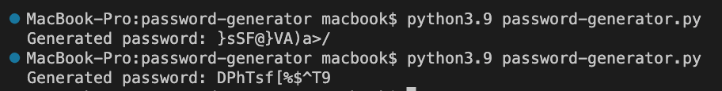

- #### To run locally

`git clone https://github.com/antoniofractuous/python-cybersecurity-projects.git`

`cd python-cybersecurity-projects/01-password-generator/`

`python3.9 password-generator.py`

- #### Expected output:

