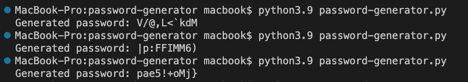

- To run locally go to your shell interpreter (terminal) and run the following commands:

### `git clone https://github.com/antoniofractuous/python-cybersecurity-projects.git`

### `cd python-cybersecurity-projects/01-password-generator/`

### `python3.9 password-generator.py`

- Expected output:

